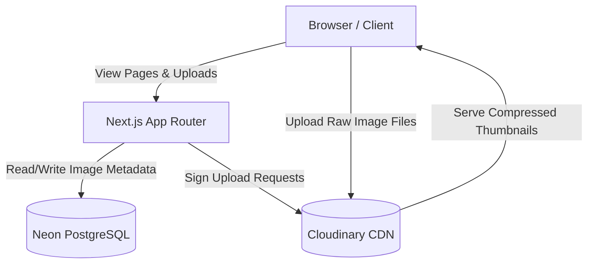
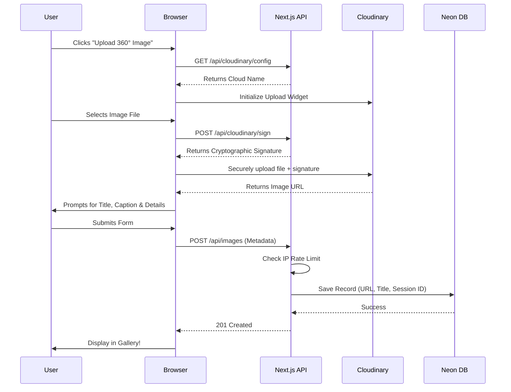

# Reimagined 🌐 - 360° Image Competition Gallery

Welcome to **Reimagined**, a sleek and modern full-stack web application built for hosting a 360-degree image competition. The platform allows users to upload, view, like, and download stunning immersive panoramas. 

---

## 📑 Table of Contents

1. [Overview](#overview)
2. [Key Features](#key-features)
3. [System Architecture](#system-architecture)
4. [How It Works (Upload Flow)](#how-it-works-upload-flow)
5. [Technology Stack](#technology-stack)
6. [Local Setup & Installation](#local-setup--installation)
7. [Environment Variables](#environment-variables)

---

## 🔎 Overview

**Reimagined** was built with a premium "Swiss Design" aesthetic featuring deep dark modes, glassmorphism UI elements, and highly interactive components. It uses Pannellum to render beautiful 360° views directly in the browser and leverages Cloudinary for aggressive image compression and lightning-fast delivery.

---

## ✨ Key Features

- **Immersive 360° Viewer:** View panoramic images in full 360 degrees using interactive drag-and-zoom controls.
- **Secure Image Uploads:** Users can seamlessly upload massive 360° files using the Cloudinary Upload Widget. All uploads are cryptographically signed on the backend for maximum security.
- **Smart Image Compression:** Gallery thumbnails are automatically resized and heavily compressed (`w_400,q_auto,f_auto`) via Cloudinary URL transformations to save bandwidth. Full-resolution images only load when viewed in the modal.
- **Anti-Spam Rate Limiting:** A custom API middleware tracks IP addresses and temporarily blocks users who try to upload too many images at once.
- **Session-Based "Like" System:** An anonymous cookie-based session tracking system ensures users can't spam the "Like" button on a single image.

---

## 🏗️ System Architecture

Below is a diagram showing how the different parts of the Reimagined application communicate with each other.



---

## 🔄 How It Works (Upload Flow)

When a user submits a new 360° image, the system follows a secure multi-step process to ensure data integrity and security.



---

## 💻 Technology Stack

- **Frontend:** Next.js (React), Vanilla CSS (CSS Modules), Google Inter Font.
- **Backend:** Next.js API Routes (Serverless Functions).
- **Database:** PostgreSQL (Hosted on Neon), managed via Prisma ORM.
- **Storage & CDN:** Cloudinary (Signed Uploads & On-the-fly transformations).
- **360° Engine:** Pannellum (Lightweight, pure JavaScript panorama viewer).

---

## 🚀 Local Setup & Installation

To run this project on your local machine, follow these steps:

1. **Clone the repository** (if applicable) and navigate to the folder.
2. **Install dependencies:**
   ```bash
   npm install
   ```
3. **Set up the Database:**
   Ensure your `.env` file is configured correctly (see below), then push the database schema to your Neon Postgres database:
   ```bash
   npx prisma db push
   ```
4. **Run the Development Server:**
   ```bash
   npm run dev
   ```
5. Open your browser and navigate to `http://localhost:3000`.

---

## 🔑 Environment Variables

You must create a `.env` file at the root of your project with the following variables:

```env
# Neon PostgreSQL Connection String
DATABASE_URL="postgresql://<user>:<password>@<host>/<dbname>?sslmode=require"

# Cloudinary URL (Includes API Key and Secret)
CLOUDINARY_URL="cloudinary://<api_key>:<api_secret>@<cloud_name>"
```

> **Note:** The backend automatically reads `CLOUDINARY_URL` and derives the cloud name, API key, and API secret required to sign uploads and interact with the Cloudinary CDN.
